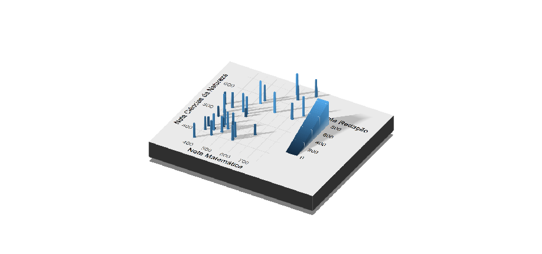

Criando gráficos 3D com Rayshader
================
Evandro da Silva Magalhães Jr
Novembro de 2020

# Resumo

Este repositório foi criando em cima de uma ideia que surgiu quando eu
estava assistindo uma palestra da Rstudio Conf 2020 apresentada pelo
[Tyler Morgan](https://twitter.com/tylermorganwall) que está disponível
no [Link](https://www.youtube.com/watch?v=G6Y3-_GKtcs). Na apresentação
ele mostrou algumas formas de criar animações e figuras tridimensionais
utilizando o pacote [Rayshader](https://www.rayshader.com/) em conjunto
ao [ggplot2](https://ggplot2.tidyverse.org/). Foram mostradas algumas
aplicações da integração desses dois pacotes relacionadas a criação de
mapas mas aqui focaremos na criação de gráficos com 3 dimensões.

Para mais informações ou detalhamento de todas as funções do pacote
acesse o [repositório](https://github.com/tylermorganwall/rayshader) do
autor.

# Resultados

# Exemplo do autor

Um dos exemplos mostrado durante a palestra pelo autor é essa
visualização 3D dos dados da base de dados mtcars. Esse exemplo serviu
como base para o que será mostrado a seguir.

<!-- -->

# Exemplo com Dados Escolares

Para criar esse gráfico foram utilizados os dados de Enem no ano de
2018, que está disponível no site do
[INEP](https://www.gov.br/inep/pt-br/acesso-a-informacao/dados-abertos/microdados/enem).
Essa análise foi feita com uma redução da base de dados original, já que
ela tem um tamanho muito grande. Assim a base foi utilizada apenas para
ser um exemplo com dados reais, as análises não devem ser consideradas,
pois foi feita uma redução muito grande do conjunto de dados.

Foram considerados somente alunos do Distrito Federal que estiveram
presentes em todos os dias de prova. Para simular o resultado de uma
turma, foram separados 32 linhas da base de dados e as variáveis
utilizadas no gráfico são referentes as notas de matemática, ciências da
natureza e redação.

<!-- -->

# Referencial Bibliográfico

Matt Dowle and Arun Srinivasan (2019). data.table: Extension of
`data.frame`. R package version 1.12.8.
<https://CRAN.R-project.org/package=data.table>

Tyler Morgan-Wall (2020). rayshader: Create Maps and Visualize Data in
2D and 3D. R package version 0.19.5.
<https://github.com/tylermorganwall/rayshader>

Wickham et al., (2019). Welcome to the tidyverse. Journal of Open Source
Software, 4(43), 1686, <https://doi.org/10.21105/joss.01686>
